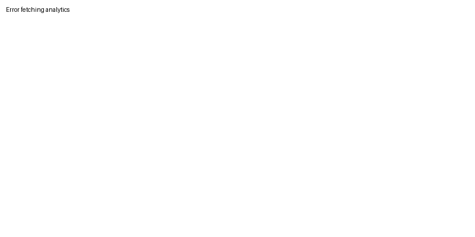

<!-- Mac Style Window Buttons -->

<!-- Window Buttons -->

  
  
  

<!-- Terminal-Like Intro -->

  

<!-- Header -->

  <h1 style="
    font-weight: bold;
    margin: 0;
    background: linear-gradient(120deg, #7aa2f7, #9ece6a);
    -webkit-background-clip: text;
    -webkit-text-fill-color: transparent;
    font-size: 2.5em;
  ">
    Hi, I'm toxi360
  </h1>

<!-- Typing SVG -->

  

<!-- Tech Stack Section -->
<h2 style="
  background: linear-gradient(120deg, #7aa2f7, #9ece6a);
  -webkit-background-clip: text;
  -webkit-text-fill-color: transparent;
  font-size: 1.8em;
">
  🛠️ Tech Stack
</h2>

<!-- Languages -->
<h3 style="color: #7aa2f7; margin: 20px 0;">Languages</h3>

  

<!-- Tools -->
<h3 style="color: #7aa2f7; margin: 20px 0;">Tools</h3>

  
  
  
  
  
  
  
  

<!-- Frameworks -->
<h3 style="color: #7aa2f7; margin: 20px 0;">Frameworks & Libraries</h3>

  

<!-- Desktop Frameworks -->
<h3 style="color: #7aa2f7; margin: 20px 0;">Desktop Development</h3>

  
  
  
  

<!-- Databases -->
<h3 style="color: #7aa2f7; margin: 20px 0;">Databases</h3>

  

<!-- About Me -->
<h2 style="
  background: linear-gradient(120deg, #7aa2f7, #9ece6a);
  -webkit-background-clip: text;
  -webkit-text-fill-color: transparent;
  font-size: 1.8em;
">
  🚀 About Me
</h2>

### 🎯 Quick Facts
- 🚀 Young and passionate **software developer**
- 🏠 Managing my own **homelab setup**
- 💼 **Desktop App focused developer** passionate about native applications
- ⚡ Early starter in tech with strong **desktop development** focus

### 🛠 What I Do
- 🔧 Optimize complex database queries
- 🐧 Configure and manage Linux servers
- 🏗 Explore innovative architectural designs
- 💝 Contribute to open-source projects
- 🔒 Prioritize user privacy in all projects

### 🌱 Currently
- 🖥 Primarily focused on **Desktop Application Development**
- 🎨 Building modern UIs with **Qt**, **CustomTkinter**, and **Dear PyGui**
- 🚀 Creating cross-platform applications with **Python**
- 📚 Always exploring new desktop development frameworks
- 🏢 Self-hosting most projects in my **homelab** using **Cloudflare Tunnels**

### 💭 Philosophy & Infrastructure
- 🎯 Combining **technical depth with curiosity**
- 🤝 Strong believer in collaborative development
- 🔄 Continuous learning and improvement
- ✨ Building elegant solutions to complex problems
- 🏠 Self-hosting all services (except YouTubeGO) in personal homelab
- 🔐 Strict privacy policy: Only collecting essential Cloudflare logs, no additional telemetry or data collection
- 🛡️ Secure infrastructure using Cloudflare Tunnels for all self-hosted services

<!-- GitHub Stats -->

  <!-- Most Used Languages -->
  
   
  <!-- GitHub Trophies - Modern Design -->
  

<!-- My Personal Web Projects -->
<h2 style="
  color: #76f9c7;
  text-shadow: 0 0 4px #76f9c7;
  margin-top: 30px;
">
  🌐 My Personal Web Projects
</h2>

<!-- Weekly Visitors Stats -->

  <h3 style="color: #7aa2f7; margin: 20px 0;">📊 Weekly Visitors Stats</h3>
  

    

      
    

  

  <!-- Project 1: Notetolink -->
  

    <h3 style="color: #fff; margin-bottom: 10px;">Notetolink</h3>
    

      A secure and user-friendly platform to create, upload images, and share notes effortlessly.
    

    <ul style="list-style: none; padding: 0; color: #f0f0f0; font-size: 14px; text-align: left; margin: 10px 0;">
      <li>✔️Secure note storage(AES-256)</li>
      <li>✔️Image uploading</li>
      <li>✔️Effortless sharing</li>
      <li>✔️Clean & user-friendly interface</li>
    </ul>
    <a
      href="https://noteto.link"
      target="_blank"
      style="
        display: inline-block;
        margin-top: 10px;
        padding: 8px 16px;
        background-color: #333;
        color: #fff;
        border-radius: 5px;
        text-decoration: none;
        font-size: 14px;
        transition: background-color 0.3s, transform 0.3s;
      "
      onmouseover="this.style.backgroundColor='#555'; this.style.transform='scale(1.05)'"
      onmouseout="this.style.backgroundColor='#333'; this.style.transform='scale(1)'"
    >
      🔗 Visit Notetolink
    </a>
  

  <!-- Project 3: YouTubeGO -->
  

    <h3 style="color: #fff; margin-bottom: 10px;">YouTubeGO</h3>
    

      A lightweight tool for downloading and managing YouTube content. 
      Grab the EXE version or explore more on GitHub.
    

    

      <a
        href="https://github.com/Efeckc17/YoutubeGO"
        target="_blank"
        style="
          display: inline-block;
          margin-top: 10px;
          padding: 8px 16px;
          background-color: #ff0000;
          color: #fff;
          border-radius: 5px;
          text-decoration: none;
          font-size: 14px;
          transition: background-color 0.3s, transform 0.3s;
        "
        onmouseover="this.style.backgroundColor='#ff4c4c'; this.style.transform='scale(1.05)'"
        onmouseout="this.style.backgroundColor='#ff0000'; this.style.transform='scale(1)'"
      >
        🔗 GitHub Repo
      </a>
      <a
        href="https://youtubego.org/"
        target="_blank"
        style="
          display: inline-block;
          margin-top: 10px;
          padding: 8px 16px;
          background-color: #000;
          color: #fff;
          border-radius: 5px;
          text-decoration: none;
          font-size: 14px;
          transition: background-color 0.3s, transform 0.3s;
        "
        onmouseover="this.style.backgroundColor='#444'; this.style.transform='scale(1.05)'"
        onmouseout="this.style.backgroundColor='#000'; this.style.transform='scale(1)'"
      >
        🔗 Visit Website
      </a>
    

  

  <!-- Project: PublishAPI -->
  

    <h3 style="color: #fff; margin-bottom: 10px;">PublishAPI</h3>
    

      Powerful Sentiment Analysis API that provides instant insights into the emotional tone of any text.
    

    <ul style="list-style: none; padding: 0; color: #f0f0f0; font-size: 14px; text-align: left; margin: 10px 0;">
      <li>✔️ Fast & Reliable Analysis</li>
      <li>✔️ Secure & Private Data Handling</li>
      <li>✔️ Easy REST API Integration</li>
      <li>✔️ Comprehensive Documentation</li>
    </ul>
    

      <a
        href="https://publishapi.org/docs"
        target="_blank"
        style="
          display: inline-block;
          margin-top: 10px;
          padding: 8px 16px;
          background-color: #2196F3;
          color: #fff;
          border-radius: 5px;
          text-decoration: none;
          font-size: 14px;
          transition: background-color 0.3s, transform 0.3s;
        "
        onmouseover="this.style.backgroundColor='#1976D2'; this.style.transform='scale(1.05)'"
        onmouseout="this.style.backgroundColor='#2196F3'; this.style.transform='scale(1)'"
      >
        📚 Documentation
      </a>
      <a
        href="https://publishapi.org/"
        target="_blank"
        style="
          display: inline-block;
          margin-top: 10px;
          padding: 8px 16px;
          background-color: #4CAF50;
          color: #fff;
          border-radius: 5px;
          text-decoration: none;
          font-size: 14px;
          transition: background-color 0.3s, transform 0.3s;
        "
        onmouseover="this.style.backgroundColor='#388E3C'; this.style.transform='scale(1.05)'"
        onmouseout="this.style.backgroundColor='#4CAF50'; this.style.transform='scale(1)'"
      >
        🔗 Visit Website
      </a>
    

  

  <!-- Project: PulseTimer -->
  

    <h3 style="color: #fff; margin-bottom: 10px;">PulseTimer</h3>
    

      A modern, feature-rich work timer application designed to boost productivity through structured work and break sessions.
    

    <ul style="list-style: none; padding: 0; color: #f0f0f0; font-size: 14px; text-align: left; margin: 10px 0;">
      <li>✔️ Customizable Work Sessions</li>
      <li>✔️ Smart Break Management</li>
      <li>✔️ Desktop Notifications</li>
      <li>✔️ Sound Alerts</li>
    </ul>
    <a
      href="https://timer.toxi360.org/"
      target="_blank"
      style="
        display: inline-block;
        margin-top: 10px;
        padding: 8px 16px;
        background-color: #673AB7;
        color: #fff;
        border-radius: 5px;
        text-decoration: none;
        font-size: 14px;
        transition: background-color 0.3s, transform 0.3s;
      "
      onmouseover="this.style.backgroundColor='#7E57C2'; this.style.transform='scale(1.05)'"
      onmouseout="this.style.backgroundColor='#673AB7'; this.style.transform='scale(1)'"
    >
      ⏲️ Try PulseTimer
    </a>
  

<!-- Contact Links -->

  
  
  

